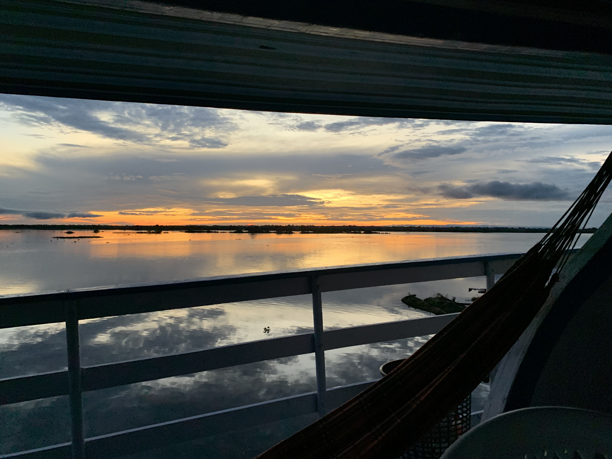

#Collaborative Team Project - Team Squad
#Members: Stella Wiegert, Jeff Back, Revy Smith, and Thomas Nygaard

This is a living document of our collaborative team guidelines on how we will execute this project

[Link to class Textbook](https://moderndive.com/v2/)

##Division of Labour for team:

@JeffBack51 @RevySmith @stellawiegert-ui @tomnygaard

4.1-4.3 Jeff Back creating the README.md
4.4 Revy reviewing pull request and leaving a comment
All members pull changes onto their branches

5.1-5.3 Thomas making changes to the README.md and TEAMWORK.md
5.4 - Stella review these documents and leave a comment and approve pull request
All members pull changes onto their branches

6.1-6.6
Member A - Revy
Member B - Stella
Member C - Jeff
6.6 - Jeff

Exercise 7: ALL review

Submit to Canvas and tagging release (exercise 8): Stella

##Timing

- [ ] 4.1-4.3 - EOD 10/6
- [ ] 4.4 - EOD 10/6
- [ ] ALL of 4 done EOD 10/6

- [ ] 5.1-5.3 - EOD 10/7
- [ ] 5.4 - EOD 10/7
- [ ] ALL of 5 done class on 10/8

- [ ] ALL 6 done by EOD 10/11
- [ ] Review on 10/12 - 10/13 and submit EOD 10/13

##Communication
We will communicate over text if any issues come up or we need to update on the statuses of different steps
We will try to respond to messages with 24 hours but preferably as soon as possible. 
We will rely exclusively on asynchronus communication and will not hold a regular meeting. 

